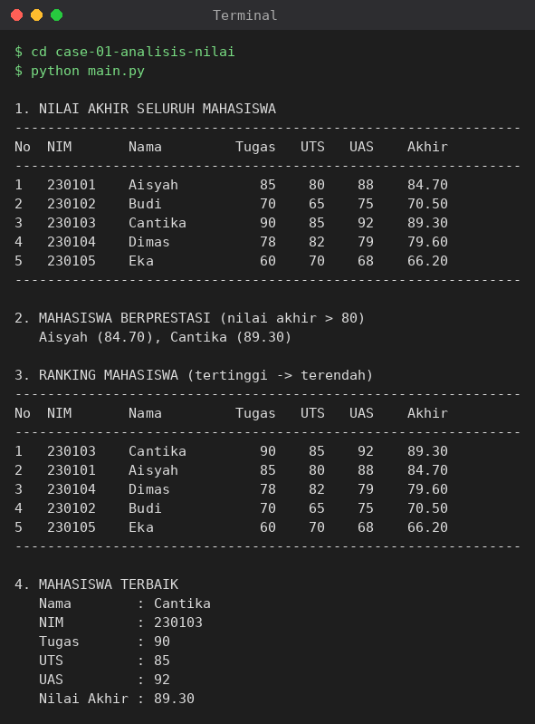

# Studi Kasus 1 — Analisis Nilai Mahasiswa

## Masalah yang diselesaikan
Bagian akademik menerima data nilai mahasiswa dalam bentuk list of dictionary.
Program ini menghitung nilai akhir (Tugas 30%, UTS 30%, UAS 40%), memfilter
mahasiswa berprestasi (nilai akhir > 80), membuat ranking, dan mengumumkan
mahasiswa terbaik, tanpa perulangan `for` bersarang.

## Konsep Python yang digunakan
- **List comprehension**: `[{**m, "nilai_akhir": ...} for m in data_mahasiswa]` untuk menambah nilai akhir ke setiap data.
- **Lambda function**: sebagai predikat `filter()` dan `key` pada `sorted()`.
- **Filtering & sorting**: `filter(lambda ...)` dan `sorted(..., key=lambda ..., reverse=True)`.

## Cara menjalankan
```bash
cd case-01-analisis-nilai
python main.py
```

## Bukti eksekusi

