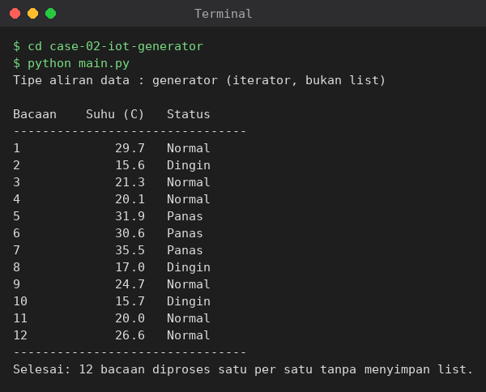

# Studi Kasus 2 — Streaming Data Sensor IoT Hemat Memori

## Masalah yang diselesaikan
Stasiun cuaca mengirim ribuan bacaan suhu per jam. Memuat semuanya ke dalam
satu list akan menguras RAM. Program ini mensimulasikan sensor dengan
generator sehingga data diproduksi dan diproses satu per satu saat diminta,
lalu langsung dikategorikan: **Dingin** (< 20°C), **Normal** (20–30°C),
**Panas** (> 30°C).

## Konsep Python yang digunakan
- **Generator function**: `sensor_suhu()` memakai `yield` untuk menghasilkan suhu acak 15.0–38.0°C.
- **Iterator pattern**: generator dikonsumsi bertahap lewat `next()`.
- **Efisiensi memori**: tidak ada list besar; aliran bahkan tak terbatas, namun memori tetap konstan.

## Cara menjalankan
```bash
cd case-02-iot-generator
python main.py
```

## Bukti eksekusi

