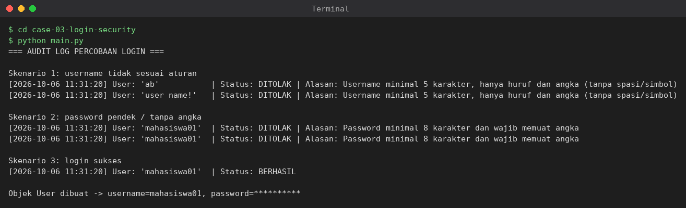

# Studi Kasus 3 — Sistem Keamanan Akun & Audit Log Login

## Masalah yang diselesaikan
Verifikasi login harus punya aturan format kredensial yang ketat dan setiap
percobaan (berhasil maupun gagal) harus tercatat otomatis tanpa mengotori
logika otentikasi.

**Aturan validasi**
- Username: minimal 5 karakter, hanya huruf dan angka.
- Password: minimal 8 karakter dan memuat minimal satu angka.

## Konsep Python yang digunakan
- **RegEx (`re`)**: `^[A-Za-z0-9]{5,}$` untuk username dan `^(?=.*\d).{8,}$` (lookahead) untuk password.
- **Decorator & closure**: `audit_log` membungkus fungsi `login` dan mencatat timestamp, username, status `BERHASIL`/`DITOLAK` beserta alasannya.
- **`@property`**: class `User` mengenkapsulasi `username` dan `password` dengan getter/setter yang memvalidasi.

## Cara menjalankan
```bash
cd case-03-login-security
python main.py
```

## Bukti eksekusi

